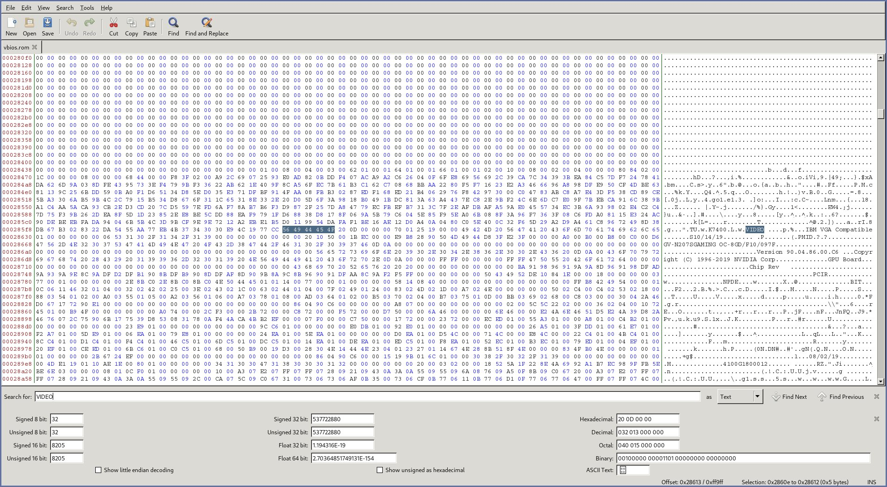
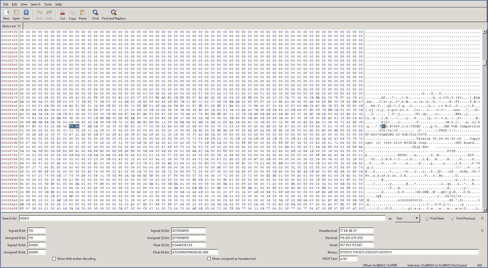

# VFIO Single GUP Passthrough

<!-- TOC -->

- [VFIO Single GUP Passthrough](#vfio-single-gup-passthrough)
    - [Enable & Verify IOMMU](#enable--verify-iommu)
    - [Install required tools](#install-required-tools)
    - [Setup Guest OS](#setup-guest-os)
    - [Guest OS Hardware](#guest-os-hardware)
        - [Add](#add)
        - [Remove Optional](#remove-optional)
    - [GPU patching](#gpu-patching)
    - [Passthrough the GPU](#passthrough-the-gpu)
        - [NVIDIA](#nvidia)
        - [AMD](#amd)
    - [Libvirt Hooks](#libvirt-hooks)
        - [NVIDIA](#nvidia)
        - [AMD](#amd)
    - [Optional customization](#optional-customization)
        - [CPU Pinning](#cpu-pinning)
        - [Nested virtualization](#nested-virtualization)

<!-- /TOC -->

## Enable & Verify IOMMU

Ensure that AMD-Vi is supported by the CPU and enabled in the BIOS settings.

Enable IOMMU support by setting the kernel parameter.

| /etc/default/grub                                          |
| :--------------------------------------------------------: |
| GRUB_CMDLINE_LINUX_DEFAULT="... amd_iommu=on iommu=pt ..." |

After rebooting, check that the groups are valid.
```
$ shopt -s nullglob
for g in `find /sys/kernel/iommu_groups/* -maxdepth 0 -type d | sort -V`; do
    echo "IOMMU Group ${g##*/}:"
    for d in $g/devices/*; do
        echo -e "\t$(lspci -nns ${d##*/})"
    done;
done;
```

Example output: 
```
IOMMU Group 2:
    00:03.0 Host bridge [0600]: Advanced Micro Devices, Inc. [AMD] Starship/Matisse PCIe Dummy Host Bridge [1022:1482]
    00:03.1 PCI bridge [0604]: Advanced Micro Devices, Inc. [AMD] Starship/Matisse GPP Bridge [1022:1483]
    09:00.0 VGA compatible controller [0300]: NVIDIA Corporation TU104 [GeForce RTX 2070 SUPER] [10de:1e84] (rev a1)
    09:00.1 Audio device [0403]: NVIDIA Corporation TU104 HD Audio Controller [10de:10f8] (rev a1)
    09:00.2 USB controller [0c03]: NVIDIA Corporation TU104 USB 3.1 Host Controller [10de:1ad8] (rev a1)
    09:00.3 Serial bus controller [0c80]: NVIDIA Corporation TU104 USB Type-C UCSI Controller [10de:1ad9] (rev a1)
```

If your card is not in an isolated group, you need to perform [ACS override patch](https://wiki.archlinux.org/index.php/PCI_passthrough_via_OVMF#Bypassing_the_IOMMU_groups_(ACS_override_patch)).

## Install required tools

TODO: Install tools.
```
$ pacman -S --needed qemu libvirt edk2-ovmf virt-manager dnsmasq ebtables
```

TODO: Enable libvirtd.
```
$ systemctl enable --now libvirtd
```

Configuring libvirt.
```
$ virsh net-start default
$ virsh net-autostart default
```

TODO: Add groups to user.
```
$ usermod -aG kvm,input,libvirt <username>
```

## Setup Guest OS

When the VM creation wizard asks you to name your VM (final step before clicking "Finish"), check the "Customize before install" checkbox.

**Overview**
- **Chipset** to *Q35*
- **Firmware** to *UEFI*

**CPUs**
- **CPU model** to *host-passthrough*
- **CPU Topology**:
    - **Sockets** to *1*
    - **Cores** to *(number of cores you want to passthrough)*
    - **Threads** to *(how many virtual threads per physical core)*

You need to install the virtual machine.

## Guest OS Hardware

### Add

You need to passthrough hardware to the guest.

In the *PCI Host Device* you have to add all the components of the graphics card (NVIDIA or AMD). You can optionally add your audio, etc.

In the *USB Host Device* you can add your mouse, keyboard, microphone, etc.

### Remove (Optional)

You can remove unused hardware:
- *Display spice*
- *Channel spice*
- *Video QXL*

## GPU patching

To get a rom for your GPU you can either download one from [here](https://www.techpowerup.com/vgabios/) or use nvflash to dump the bios currently on your GPU.

Use the dumped/downloaded vbios and open it in a hex editor.

Search for the strings "VIDEO".


Then you have to search for a U that is in front of VIDEO. Delete all of the code above the U.


Save your patched vbios.

## Passthrough the GPU

### NVIDIA

Add custom rom to all **NVIDIA** components:
```
<hostdev>
  ...
  <rom file="/path/to/patched-vbios.rom"/>
</hostdev>
```

TODO: You have to add these lines to avoid NVIDIA error 43 and... :
```
<features>
  ...
  <hyperv>
    ...
    <vendor_id state="on" value="buttplug"/>
  </hyperv>
  <kvm>
    <hidden state="on"/>
  </kvm>
</features>
```

### AMD

TODO: 
```
<features>
  ...
  <hyperv>
    ...
    <vendor_id state="on" value="buttplug"/>
  </hyperv>
</features>
```

## Libvirt Hooks

Using libvirt hooks will allow us to automatically run scripts before the VM is started and after the VM has stopped.

Your directory structure should looks like this:
```
/etc/libvirt/hooks
├── kvm.conf
├── qemu <- The script that does the magic
└── qemu.d
    └── {VM Name}
        ├── prepare
        │   └── begin
        │       └── start.sh
        └── release
            └── end
                └── revert.sh
```

qemu
```
#!/bin/bash
#
# Author: Sebastiaan Meijer (sebastiaan@passthroughpo.st)
#
# Copy this file to /etc/libvirt/hooks, make sure it's called "qemu".
# After this file is installed, restart libvirt.
# From now on, you can easily add per-guest qemu hooks.
# Add your hooks in /etc/libvirt/hooks/qemu.d/vm_name/hook_name/state_name.
# For a list of available hooks, please refer to https://www.libvirt.org/hooks.html
#

GUEST_NAME="$1"
HOOK_NAME="$2"
STATE_NAME="$3"
MISC="${@:4}"

BASEDIR="$(dirname $0)"

HOOKPATH="$BASEDIR/qemu.d/$GUEST_NAME/$HOOK_NAME/$STATE_NAME"

set -e # If a script exits with an error, we should as well.

# check if it's a non-empty executable file
if [ -f "$HOOKPATH" ] && [ -s "$HOOKPATH"] && [ -x "$HOOKPATH" ]; then
    eval \"$HOOKPATH\" "$@"
elif [ -d "$HOOKPATH" ]; then
    while read file; do
        # check for null string
        if [ ! -z "$file" ]; then
          eval \"$file\" "$@"
        fi
    done <<< "$(find -L "$HOOKPATH" -maxdepth 1 -type f -executable -print;)"
fi
```

Go ahead and restart libvirt to use the newly installed hook helper
```
$ sudo service libvirtd restart
```

**Do not copy the below scripts. Use them as a template, but write your own.**

Make sure to substitute the correct bus addresses for the devices you'd like to passthrough to your VM. 
Just in case it's still unclear, you get the virsh PCI device IDs from the [Enable & Verify IOMMU](#enable--verify-iommu) script.
Translate the address for each device as follows: `IOMMU Group 1 01:00.0 ...` --> `VIRSH_...=pci_0000_01_00_0`.

kvm.conf
```
VIRSH_GPU_VIDEO=pci_0000_09_00_0
VIRSH_GPU_AUDIO=pci_0000_09_00_1
VIRSH_GPU_USB=pci_0000_09_00_2
VIRSH_GPU_SERIAL=pci_0000_09_00_3
```

### NVIDIA

start.sh
```
#!/bin/bash
# Helpful to read output when debugging
set -x

# Load variables
source "/etc/libvirt/hooks/kvm.conf"

# Stop display manager
systemctl stop lightdm.service

# Unbind VTconsoles
echo 0 > /sys/class/vtconsole/vtcon0/bind
echo 0 > /sys/class/vtconsole/vtcon1/bind

# Unbind EFI-Framebuffer
echo efi-framebuffer.0 > /sys/bus/platform/drivers/efi-framebuffer/unbind

# Avoid a Race condition
sleep 5

# Unload all Nvidia drivers
modprobe -r nvidia_drm
modprobe -r nvidia_modeset
modprobe -r nvidia_uvm
modprobe -r nvidia

# Unbind the GPU from display driver
virsh nodedev-detach $VIRSH_GPU_VIDEO
virsh nodedev-detach $VIRSH_GPU_AUDIO
virsh nodedev-detach $VIRSH_USB
virsh nodedev-detach $VIRSH_SERIAL_BUS

# Load VFIO Kernel Module  
modprobe vfio-pci 
```

revert.sh
```
#!/bin/bash
# Helpful to read output when debugging
set -x

# Load variables
source "/etc/libvirt/hooks/kvm.conf"

# Unload VFIO-PCI Kernel Driver
modprobe -r vfio-pci
modprobe -r vfio_iommu_type1
modprobe -r vfio

# Rebind GPU to Nvidia Driver
virsh nodedev-reattach $VIRSH_GPU_VIDEO
virsh nodedev-reattach $VIRSH_GPU_AUDIO
virsh nodedev-reattach $VIRSH_USB
virsh nodedev-reattach $VIRSH_SERIAL_BUS

# Rebind VT consoles
echo 1 > /sys/class/vtconsole/vtcon0/bind
echo 1 > /sys/class/vtconsole/vtcon1/bind

# Bind EFI-Framebuffer
nvidia-xconfig --query-gpu-info > /dev/null 2>&1
echo "efi-framebuffer.0" > /sys/bus/platform/drivers/efi-framebuffer/bind

# Load all Nvidia drivers
modprobe nvidia_drm
modprobe nvidia_modeset
modprobe drm_kms_helper
modprobe drm
modprobe nvidia_uvm
modprobe nvidia

# Restart Display Manager
systemctl start lightdm.service
```

### AMD

start.sh
```
#!/bin/bash
set -x

# load variables
source "/etc/libvirt/hooks/kvm.conf"

# Stop display manager
systemctl stop lightdm.service

# Stop pipewire
pulse_pid=$(pgrep -u quentin pulseaudio)
pipewire_pid=$(pgrep -u quentin pipewire-media)
kill $pulse_pid
kill $pipewire_pid

# Unbind VTconsoles
echo 0 > /sys/class/vtconsole/vtcon0/bind
echo 0 > /sys/class/vtconsole/vtcon1/bind

# Unbind EFI Framebuffer
# echo efi-framebuffer.0 > /sys/bus/platform/drivers/efi-framebuffer/unbind

# Avoid a race condition by waiting a couple of seconds. This can be calibrated to be shorter or longer if required for your system
sleep 5

# Unload AMD kernel module
modprobe -r amdgpu

# Detach GPU devices from host
virsh nodedev-detach $VIRSH_GPU_VIDEO
virsh nodedev-detach $VIRSH_GPU_AUDIO

# Load vfio module
modprobe vfio
modprobe vfio_pci
modprobe vfio_iommu_type1
```

revert.sh
```
#!/bin/bash
set -x

# load variables
source "/etc/libvirt/hooks/kvm.conf"

# Unload all the vfio modules
modprobe -r vfio_pci
modprobe -r vfio_iommu_type1
modprobe -r vfio

# Attach GPU devices to host
# Use your GPU and HDMI Audio PCI host device
virsh nodedev-reattach $VIRSH_GPU_VIDEO
virsh nodedev-reattach $VIRSH_GPU_AUDIO

# Rebind VTconsoles
echo 1 > /sys/class/vtconsole/vtcon0/bind
echo 1 > /sys/class/vtconsole/vtcon1/bind

# Rebind framebuffer to host
# echo "efi-framebuffer.0" > /sys/bus/platform/drivers/efi-framebuffer/bind

# Load AMD kernel module
modprobe  amdgpu
modprobe  gpu_sched
modprobe  ttm
modprobe  drm_kms_helper
modprobe  i2c_algo_bit
modprobe  drm
modprobe  snd_hda_intel

# Restart Display Manager
systemctl start lightdm.service
```

## Optional customization

### CPU Pinning

My setup has an AMD Ryzen 7 3700X which has 8 physical cores and 16 threads.

It's very important that when we passthrough a core, we include its sibling. To get a sense of your cpu topology, use the command `$ lscpu -e`. A matching core id (i.e. "CORE" column) means that the associated threads (i.e. "CPU" column) run on the same physical core.
```
CPU NODE SOCKET CORE L1d:L1i:L2:L3 ONLINE    MAXMHZ    MINMHZ
  0    0      0    0 0:0:0:0          yes 4823.4370 2200.0000
  1    0      0    1 1:1:1:0          yes 4559.7651 2200.0000
  2    0      0    2 2:2:2:0          yes 4689.8428 2200.0000
  3    0      0    3 3:3:3:0          yes 4426.1709 2200.0000
  4    0      0    4 4:4:4:1          yes 5224.2178 2200.0000
  5    0      0    5 5:5:5:1          yes 5090.6250 2200.0000
  6    0      0    6 6:6:6:1          yes 5224.2178 2200.0000
  7    0      0    7 7:7:7:1          yes 4957.0308 2200.0000
  8    0      0    0 0:0:0:0          yes 4823.4370 2200.0000
  9    0      0    1 1:1:1:0          yes 4559.7651 2200.0000
 10    0      0    2 2:2:2:0          yes 4689.8428 2200.0000
 11    0      0    3 3:3:3:0          yes 4426.1709 2200.0000
 12    0      0    4 4:4:4:1          yes 5224.2178 2200.0000
 13    0      0    5 5:5:5:1          yes 5090.6250 2200.0000
 14    0      0    6 6:6:6:1          yes 5224.2178 2200.0000
 15    0      0    7 7:7:7:1          yes 4957.0308 2200.0000
```

TODO: According to the logic seen above, here are my core and their threads binding
```
Core 1: 0, 8
Core 2: 1, 9
Core 3: 2, 10
Core 4: 3, 11
Core 5: 4, 12
Core 6: 5, 13
Core 7: 6, 14
Core 8: 7, 15
```

TODO: I want to get 1 core for the host and 7 cores for the host.

It's time to edit the XML configuration of our VM, I show you the final result, everything will be explained below.
```
<vcpu placement="static">14</vcpu>
<iothreads>1</iothreads>
<cputune>
  <vcpupin vcpu="0" cpuset="1"/>
  <vcpupin vcpu="1" cpuset="9"/>
  <vcpupin vcpu="2" cpuset="2"/>
  <vcpupin vcpu="3" cpuset="10"/>
  <vcpupin vcpu="4" cpuset="3"/>
  <vcpupin vcpu="5" cpuset="11"/>
  <vcpupin vcpu="6" cpuset="4"/>
  <vcpupin vcpu="7" cpuset="12"/>
  <vcpupin vcpu="8" cpuset="5"/>
  <vcpupin vcpu="9" cpuset="13"/>
  <vcpupin vcpu="10" cpuset="6"/>
  <vcpupin vcpu="11" cpuset="14"/>
  <vcpupin vcpu="12" cpuset="7"/>
  <vcpupin vcpu="13" cpuset="15"/>
  <emulatorpin cpuset="0,8"/>
  <iothreadpin iothread="1" cpuset="0,8"/>
</cputune>
```

This command allows you to give the number of threads you want to pass to the guest
```
<vcpu placement="static">14</vcpu>
```

vcpu corresponds to the guest cores, increment by 1 starting with 0.  
cpuset correspond to your threads you want to passthrough. It is necessary that your core and their threads binding follow each other.
```
<cputune>
  <vcpupin vcpu="0" cpuset="1"/>
  <vcpupin vcpu="1" cpuset="9"/>
  <vcpupin vcpu="2" cpuset="2"/>
  <vcpupin vcpu="3" cpuset="10"/>
  <vcpupin vcpu="4" cpuset="3"/>
  <vcpupin vcpu="5" cpuset="11"/>
  <vcpupin vcpu="6" cpuset="4"/>
  <vcpupin vcpu="7" cpuset="12"/>
  <vcpupin vcpu="8" cpuset="5"/>
  <vcpupin vcpu="9" cpuset="13"/>
  <vcpupin vcpu="10" cpuset="6"/>
  <vcpupin vcpu="11" cpuset="14"/>
  <vcpupin vcpu="12" cpuset="7"/>
  <vcpupin vcpu="13" cpuset="15"/>
  ...
</cputune>
```

The number of cores you want to passthrough
```
<iothreads>1</iothreads>
```

cpuset corresponds to the bindings of your host core.
```
<cputune>
  ...
  <emulatorpin cpuset="0,8"/>
  <iothreadpin iothread="1" cpuset="0,8"/>
</cputune>
```

### Nested virtualization

This allows your virtual machine to bypass some anti-cheats

```
<domain xmlns:qemu="http://libvirt.org/schemas/domain/qemu/1.0" type="kvm">
  ...
  <qemu:commandline>
    <qemu:arg value="-global"/>
    <qemu:arg value="kvm-pit.lost_tick_policy=discard"/>
    <qemu:arg value="-rtc"/>
    <qemu:arg value="base=localtime"/>
    <qemu:arg value="-cpu"/>
    <qemu:arg value="host,host-cache-info=on,kvm=off,l3-cache=on,kvm-hint-dedicated=on,migratable=no,hv_relaxed,hv_spinlocks=0x1fff,hv_vapic,hv_time,hv_vendor_id=Nvidia43FIX,+invtsc,+topoext"/>
  </qemu:commandline>
</domain>
```

Enable Hyper-V under windows virtual machine, reboot virtual machine.